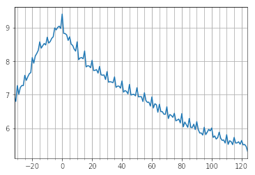

# Train - Delay

Predicting the delay of amtrak trains based on their past performance.

Test the app on https://train-delay-prediction.herokuapp.com/amtrak/ (takes up to a minute to load on the initial visit).

# Project Details

## Data
* Source: Amtrak train data from http://statusmaps.com (900,000 text files - zipped)
* Cleaned data and transformed the data into one csv table. Code can be found [here](https://github.com/philipp-bir/amtrak_data/blob/master/amtrak_dataset.py).
* Distribution of minutes of delay as a logarithmic plot:

* Average delay per day of the year:

* The delay turns out to be hard to predict, there is a lot of noise. Still, just guessing the mean per train results in a mean absolute error of 65 minutes, which could be improved in this project to about 30 minutes.
* This project uses an xgboost model for the predictions.
* We also calculated error intervals for each train. This answers the question on how much time we have to add and subtract to the generated estimate to guarantee that at least 70% of the predictions are within the resulting interval.
* More details on the model and error interval generation can be found in [this notebook](https://github.com/philipp-bir/amtrak_data/blob/master/amtrak%20prediction%20models.ipynb).

## Back End
* This is a Django project, based off the [getting-started-with-python](https://github.com/heroku/python-getting-started) version for Heroku.
* Uses SQLite database for storage of train meta data, utilizing the Django ORM. (Can easily changed to PostgreSQL or others)
* Offers endpoint `/predict` to consume form data and return estimate interval as json. 
* To make the prediction the trained xgboost model is loaded from the data folder together with transformation data.
* Using pandas and that xgboost model the prediction is calculated.
* The train meta data stores how many minutes to subtract and add to the estimate to generate the 70% estimate interval.

## Front End
* Simple html form.
* jQuery script submits form data in the background and receives json data and displays the result (or error)

# Deployment
This is a complete heroku app utilizing django. It can be deployed on https://heroku.com by just pushing this repository.
Run `python manage.py populate_db "amtrak/data/train_meta_data.csv"` on the server to copy train meta data from the `data` folder into the database.
